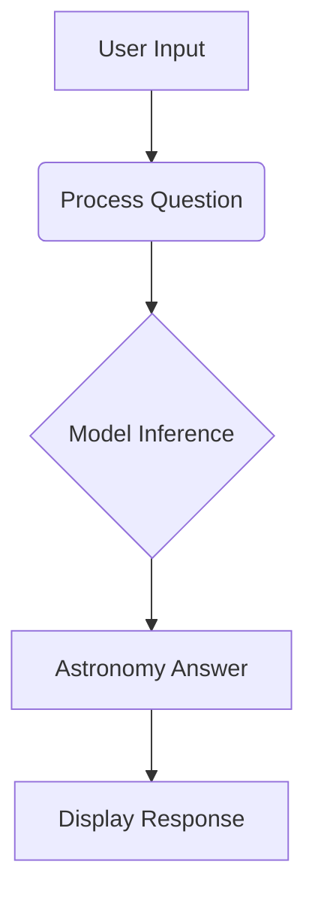
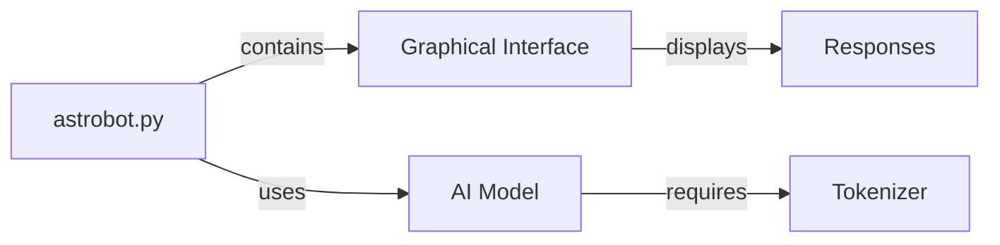

###🌌 AstroBot - Astronomy Chatbot 🤖

https://images.unsplash.com/photo-1462331940025-496dfbfc7564?w=1000&auto=format&fit=crop

AstroBot is an AI-powered chatbot specialized in astronomy, built as a university project. It uses a pre-trained language model to answer questions about the universe, stars, planets, and cosmic phenomena.

🚀 Features

🌠 Specialized in astronomy topics

🧠 Powered by NVIDIA's Nemotron-Research-Reasoning-Qwen-1.5B model

💬 Interactive GUI with conversation history

🖥️ Cross-platform (works on Windows, macOS, Linux)

⚡ GPU acceleration support (via CUDA if available)

## 🔧 Installation

1. Clone the repository:
   ```bash
   git clone https://github.com/ParaQueNome/chatbot_v2.git
   cd astrobot
   ```

2. Install dependencies:
   ```bash
   pip install torch transformers tkinter
   ```

3. Run the application:
   ```bash
   python astrobot.py
   ```
🛠️ System Requirements

pie
    title System Requirements
    "Python 3.8+" : 30
    "4GB RAM" : 25
    "NVIDIA GPU (optional)" : 20
    "2GB Disk Space" : 15
    "Internet Connection" : 10

Python 3.8+

4GB RAM (8GB recommended)

NVIDIA GPU with CUDA support (optional for faster inference)

2GB free disk space (for model weights)

📚 Sample Questions to Ask
🔭 Try these astronomy topics:

"Explain black holes"

"What is the composition of Jupiter's atmosphere?"

"How do stars form?"

"Describe the Big Bang theory"

"What are exoplanets?"

📊 Project Structure

🌟 Future Enhancements
Add astronomical image generation

Integrate with NASA APIs for real-time data

Include interactive star maps

Add voice interaction capability

Implement multilingual support

📜 License
This project is licensed under the MIT License - see the LICENSE file for details.

🙏 Acknowledgments
NVIDIA for the pre-trained model

Hugging Face for the Transformers library

Tkinter for the GUI framework

Professor Cleberson Eugenio for guidance
